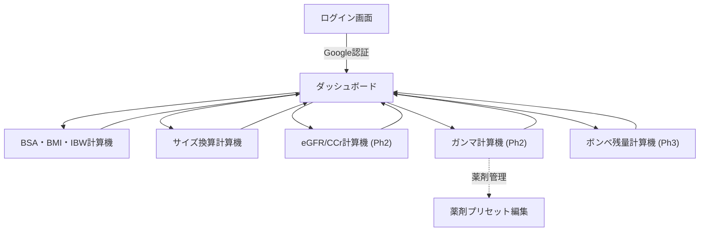

# 医療用計算機アプリケーション 要件定義書

**作成日**: 2026年3月10日 | **更新日**: 2026年3月11日 | **バージョン**: 2.0

---

## 1. プロジェクト概要

### 1.1 目的

医療現場で頻繁に使用する各種計算を、スマートフォン等のモバイル端末からブラウザで手軽に行えるWebアプリケーションを開発する。

### 1.2 利用者・利用環境

| 項目 | 内容 |
|------|------|
| **利用者** | 個人利用（開発者本人） |
| **プラットフォーム** | PWA（Progressive Web App） |
| **主要ブラウザ** | Google Chrome |
| **主要デバイス** | モバイル端末（スマートフォン）※デスクトップも対応 |
| **認証方式** | Firebase Authentication（Google Sign-In） |
| **データ同期** | Cloud Firestore（端末間同期） |

---

## 2. 認証・データ同期

### 2.1 認証

| # | 機能 | 説明 |
|---|------|------|
| A-01 | **Googleログイン** | Firebase AuthenticationによるGoogle Sign-In |
| A-02 | **ログアウト** | ログアウトボタンで認証解除 |
| A-03 | **アクセス制限** | 未ログイン時はログイン画面を表示 |

### 2.2 データ同期（Cloud Firestore）

| # | 機能 | 説明 |
|---|------|------|
| D-01 | **端末間同期** | ユーザー設定データをクラウド保存し端末間で共有 |
| D-02 | **同期対象** | 薬剤プリセット、お気に入り計算機など |
| D-03 | **同期対象外** | 計算結果（セッション中のみ保持） |

### 2.3 Googleドライブ連携について

> [!NOTE]
> **現時点では見送り。** 理由：
> - 計算結果の長期保存は不要（要件上の方針）
> - 同期対象データ（薬剤プリセット等）はFirestoreで十分カバー
> - Drive API連携はOAuthスコープ追加・API有効化が必要で複雑度が上がる
> - 将来「計算ログのエクスポート」が必要になった場合に再検討

---

## 3. 機能要件

### 3.1 共通機能

| # | 機能 | 説明 |
|---|------|------|
| C-01 | **ダッシュボード** | 計算機をカード形式で一覧表示。タップで遷移 |
| C-02 | **レスポンシブUI** | モバイルファースト。スマホ操作性を最優先 |
| C-03 | **PWA対応** | ホーム画面追加でアプリのように起動可能 |
| C-04 | **ダークモード** | ライト/ダーク切替。夜勤帯での使用に配慮 |
| C-05 | **お気に入り** | よく使う計算機をダッシュボード上部に固定表示 |
| C-06 | **計算機レジストリ** | モジュラー構造で新規計算機を容易に追加 |

---

### 3.2 BSA・BMI・IBW 計算機 【Phase 1】

身長と体重を入力すると、BSA・BMI・理想体重をまとめて算出。

| # | 機能 | 説明 |
|---|------|------|
| B-01 | **身長入力** | cm単位 |
| B-02 | **体重入力** | kg単位 |
| B-03 | **BSA 3式同時算出** | Du Bois式・新谷式・Mosteller式（新谷式をメイン表示、他はサブ） |
| B-04 | **BMI算出** | BMI = 体重(kg) ÷ 身長(m)² 。判定区分も表示 |
| B-05 | **理想体重（IBW）算出** | IBW = 身長(m)² × 22 |
| B-06 | **計算式解説** | 各計算式の由来・特徴・使い分けを画面内に表示 |
| B-07 | **入力バリデーション** | 不正値の検出とエラーメッセージ |

#### BSA計算式

| 計算式 | 数式 | 解説 |
|--------|------|------|
| **Du Bois式** | 0.007184 × H^0.725 × W^0.425 | 1916年提唱。世界標準だが西洋人基準 |
| **新谷式** | 0.007241 × H^0.725 × W^0.425 | 日本人データで補正。国内臨床で広く採用 |
| **Mosteller式** | √(H × W / 3600) | 簡易式。暗算に適し迅速な概算に有用 |

#### BMI判定区分（WHO / 日本肥満学会）

| 区分 | BMI |
|------|-----|
| 低体重 | < 18.5 |
| 普通体重 | 18.5 〜 24.9 |
| 肥満(1度) | 25.0 〜 29.9 |
| 肥満(2度) | 30.0 〜 34.9 |
| 肥満(3度) | 35.0 〜 39.9 |
| 肥満(4度) | ≧ 40.0 |

> *H = 身長(cm)、W = 体重(kg)*

---

### 3.3 サイズ換算計算機 【Phase 1】

2つのセクションに分けて表示。

#### セクション① mm / Fr / inch 換算

| # | 機能 | 説明 |
|---|------|------|
| S-01 | **相互換算** | mm・Fr・inchのいずれかを入力すると他2つに即時変換 |
| S-02 | **換算表** | よく使うサイズの一覧表を表示 |

| 基準 | 換算 |
|------|------|
| **Fr（フレンチ）** | 外径mm × 3 = Fr |
| **inch ↔ mm** | 1 inch = 25.4 mm |

#### セクション② G（ゲージ）対応表

| # | 機能 | 説明 |
|---|------|------|
| S-03 | **ゲージ対応表** | JIS/ISO規格に基づくG値と外径mm・内径mmの対応表 |
| S-04 | **検索・フィルタ** | G値またはmm値で対応表を絞り込み |

> [!NOTE]
> G（ゲージ）は線形換算ではないため、対応表で参照する形式とする。

#### 単位解説

| 単位 | 説明 |
|------|------|
| **mm** | メートル法に基づく外径表記 |
| **Fr（フレンチ）** | カテーテル等の外径規格。1Fr = 1/3 mm |
| **inch** | インチ規格。1 inch = 25.4 mm |
| **G（ゲージ）** | 注射針等の太さ規格。値が大きいほど細い |

---

### 3.4 eGFR / CCr 計算機 【Phase 2】

腎機能を評価する指標を算出し、薬剤投与量調整の参考にする。

| # | 機能 | 説明 |
|---|------|------|
| E-01 | **eGFR算出** | 血清Cr値・年齢・性別からeGFRを算出 |
| E-02 | **CCr算出（Cockcroft-Gault式）** | 血清Cr値・年齢・性別・体重からCCrを算出 |
| E-03 | **CKDステージ表示** | eGFR値に基づくCKD重症度分類を表示 |
| E-04 | **計算式解説** | 各指標の臨床的意義と使い分けの解説 |
| E-05 | **入力バリデーション** | 不正値の検出とエラーメッセージ |

#### 計算式

| 指標 | 計算式 | 解説 |
|------|--------|------|
| **eGFR** | 194 × Cr^(-1.094) × Age^(-0.287)（女性は×0.739） | 日本腎臓学会のeGFR推算式（日本人向け）。血清Cr・年齢・性別のみで算出可能。腎機能の経時的評価や、CKDステージの分類に使用 |
| **CCr** | {(140-Age) × W} / (72 × Cr)（女性は×0.85） | Cockcroft-Gault式。体重を考慮するため個体差を反映しやすい。薬剤の投与量調整（特に腎排泄型薬剤）の指標として広く使用 |

#### CKDステージ分類

| ステージ | eGFR (mL/min/1.73m²) | 重症度 |
|----------|----------------------|--------|
| G1 | ≧ 90 | 正常または高値 |
| G2 | 60 〜 89 | 正常または軽度低下 |
| G3a | 45 〜 59 | 軽度〜中等度低下 |
| G3b | 30 〜 44 | 中等度〜高度低下 |
| G4 | 15 〜 29 | 高度低下 |
| G5 | < 15 | 末期腎不全 |

> *Cr = 血清クレアチニン(mg/dL)、Age = 年齢、W = 体重(kg)*

---

### 3.5 ガンマ計算機 【Phase 2】

| # | 機能 | 説明 |
|---|------|------|
| G-01 | **ガンマ計算** | 体重・薬剤濃度・投与速度 → γ（μg/kg/min）を算出 |
| G-02 | **逆算** | 目標γ → 必要な投与速度(mL/h)を算出 |
| G-03 | **薬剤登録** | 薬剤名・規格量・希釈液量・希釈倍率をプリセット登録（Firestore同期） |
| G-04 | **薬剤選択** | 登録済み薬剤をプルダウン選択、濃度を自動反映 |
| G-05 | **薬剤管理** | プリセットの追加・編集・削除 |

---

### 3.6 ボンベ残量計算機 【Phase 3】

| # | 機能 | 説明 |
|---|------|------|
| T-01 | **ボンベ残量計算** | 残圧・ボンベ容量・流量 → 使用可能時間を算出 |
| T-02 | **ボンベサイズ選択** | 500L・1500Lなどプリセットから選択 |
| T-03 | **ガス種別切替** | 酸素・二酸化炭素・窒素・ヘリウムをプルダウンで選択。係数を自動反映 |
| T-04 | **残量ビジュアル表示** | メーターゲージや残量バーで視覚的に表示 |
| T-05 | **残量テーブル** | 流量ごとの使用可能時間を一覧表で表示 |

---

## 4. 非機能要件

| # | 項目 | 要件 |
|---|------|------|
| N-01 | **データ保存** | 計算結果は保存なし。設定データのみFirestore |
| N-02 | **パフォーマンス** | 即時表示（クライアントサイド処理） |
| N-03 | **セキュリティ** | Google認証 + Firestoreルールで本人データのみアクセス |
| N-04 | **拡張性** | 計算機モジュール追加で対応可能 |
| N-05 | **PWA** | ホーム画面追加、オフラインでも計算機能を利用可能 |
| N-06 | **ホスティング** | Firebase Hosting |

---

## 5. 画面構成

| 画面 | 主な要素 |
|------|----------|
| **ログイン画面** | アプリ名 + 「Googleでログイン」ボタン |
| **ダッシュボード** | お気に入り計算機 → 全計算機カード一覧。ダークモード切替 |
| **BSA・BMI・IBW** | 身長/体重入力 → BSA(3式) + BMI(判定付) + IBW同時表示 + 解説 |
| **サイズ換算** | mm/Fr/inch換算セクション + G対応表セクション |
| **eGFR/CCr** | Cr/年齢/性別/体重入力 → eGFR + CCr + CKDステージ表示 + 解説 |
| **ガンマ計算機** | 薬剤選択 + 体重/流量入力 → γ値・投与速度 |
| **ボンベ残量** | ガス/ボンベ選択 + 残圧/流量入力 → メーター + 一覧表 |

---

## 6. 技術構成

| 領域 | 技術 |
|------|------|
| **フレームワーク** | Vite + React |
| **認証** | Firebase Authentication（Google Sign-In） |
| **データベース** | Cloud Firestore |
| **ホスティング** | Firebase Hosting |
| **スタイリング** | Vanilla CSS（モバイルファースト + ダークモード対応） |
| **ルーティング** | React Router |
| **PWA** | Vite PWA Plugin |

---

## 7. フェーズ計画

| フェーズ | 内容 | 状態 |
|----------|------|------|
| **Phase 1** | 認証 + ダッシュボード + BSA/BMI/IBW + サイズ換算 + PWA + ダーク | 🔜 開発予定 |
| **Phase 2** | eGFR/CCr + ガンマ計算機（薬剤登録・Firestore同期） | 📋 計画中 |
| **Phase 3** | ボンベ残量計算機（ガス切替・メーター表示） | 📋 計画中 |
| **Phase N** | 点滴滴下速度計算機、その他（必要に応じて追加） | 💡 検討中 |
